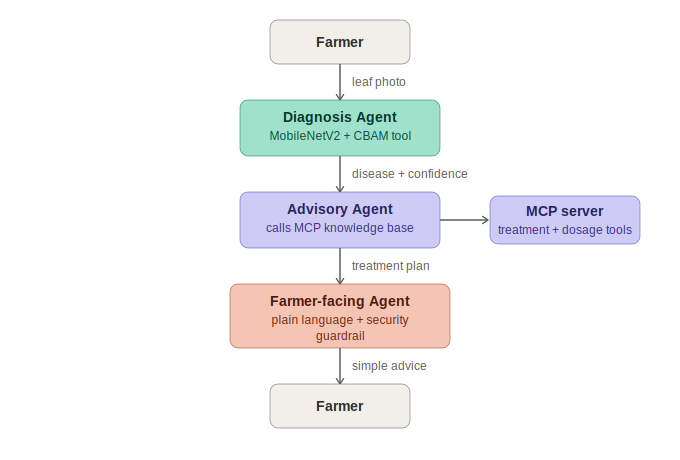

# PlantVaidya 🌱

**A multi-agent tomato leaf disease diagnosis and advisory system, built for the Kaggle "AI Agents: Intensive Vibe Coding" Capstone.**

*Track: Agents for Good*

"Vaidya" means healer/doctor in Hindi and Telugu. PlantVaidya puts a crop-health advisor in a farmer's pocket: photograph a tomato leaf, get a verified diagnosis, a safe treatment plan, and plain-language guidance — no agronomist required.

---

## The problem

Smallholder tomato farmers lose significant yield every season to diseases they can't identify in time. Agricultural extension officers are scarce relative to the number of farms, diagnostic delay costs entire harvests, and generic chatbot advice on pesticide dosage can be actively dangerous if wrong. Farmers need something that is **fast, accurate, and safe** — not a general-purpose LLM improvising agrochemical advice.

## Why agents (and not just a single model call)

A single LLM call given a leaf photo and asked "what should I do?" will hallucinate treatment details, invent dosages, and can't be trusted for something as consequential as pesticide application. PlantVaidya instead splits the problem across three single-responsibility agents so that:
- the **vision task** (disease classification) is handled by a real trained CNN, not an LLM guessing from pixels,
- the **domain knowledge** (treatments, dosages) comes from a verified knowledge base via a dedicated **MCP server**, never from LLM memory,
- the **communication task** (translating to plain language, enforcing safety) is isolated in its own agent so guardrails are enforced exactly once, at the one place the farmer actually sees output.

## Architecture



1. **Diagnosis Agent** (`agents/diagnosis_agent.py`) — wraps a fine-tuned MobileNetV2 + CBAM (Convolutional Block Attention Module) tomato leaf classifier as an ADK tool. Outputs a disease label and confidence score.
2. **MCP Server** (`mcp_server/server.py`) — a standalone process exposing a static, verified tomato-disease knowledge base as three tools: `list_diseases`, `get_treatment`, and `check_dosage_safety`.
3. **Advisory Agent** (`agents/advisory_agent.py`) — connects to the MCP server over stdio, looks up the verified treatment plan for the diagnosed disease, and is required by its own instructions to run a dosage-safety check before stating any chemical dosage.
4. **Farmer-facing Agent** (`agents/farmer_agent.py`) — rewrites the technical advisory into simple, numbered action steps (English or Telugu). Wired with a `before_model_callback` security guardrail that rejects off-topic requests before they reach the LLM, plus a post-processing pass that redacts PII and strips banned-substance mentions.
5. **Orchestrator** (`agents/orchestrator.py`) — wires the three agents into a single `SequentialAgent` pipeline (`root_agent`), ADK's built-in multi-agent workflow primitive.

## Course concepts demonstrated

| Concept | Where |
|---|---|
| Multi-agent system (ADK) | `agents/orchestrator.py` — `SequentialAgent` chaining 3 sub-agents |
| MCP Server | `mcp_server/server.py` — standalone FastMCP server, consumed via `MCPToolset` in `agents/advisory_agent.py` |
| Security features | `security/guardrails.py` — scope-limiting guardrail, PII redaction, banned-substance filter, dosage safety cap enforced twice (once via MCP tool, once as a final sanitization pass) |
| Agent skills | The trained classifier (`model/classifier.py`) is packaged as a reusable, documented tool/skill any agent can call |

## Repo structure

```
plantvaidya/
├── agents/
│   ├── diagnosis_agent.py     # vision classifier as an ADK tool
│   ├── advisory_agent.py      # MCP-connected knowledge lookup
│   ├── farmer_agent.py        # plain-language output + guardrail
│   └── orchestrator.py        # root_agent: SequentialAgent pipeline
├── mcp_server/
│   ├── server.py              # FastMCP server: treatment + dosage-safety tools
│   └── knowledge_base.json    # verified tomato disease records
├── model/
│   ├── classifier.py          # TomatoDiseaseClassifier (real + demo mode)
│   └── cbam.py                # CBAM attention module (Keras)
├── security/
│   └── guardrails.py          # scope limiting, PII redaction, safety checks
├── demo/
│   ├── cli_demo.py            # full pipeline demo (needs GOOGLE_API_KEY)
│   └── no_llm_smoke_test.py   # tests classifier + MCP + guardrails, no API key needed
├── docs/
│   └── architecture.svg
├── requirements.txt
└── .env.example
```

## Setup

```bash
git clone <this-repo>
cd plantvaidya
python3 -m venv venv && source venv/bin/activate
pip install -r requirements.txt

cp .env.example .env
# edit .env and add your Gemini API key (https://aistudio.google.com/apikey)
export GOOGLE_API_KEY=your_key_here
```

### Quick check — no API key required

Verifies the classifier, MCP knowledge-base tools, and security guardrails all work correctly on their own:

```bash
python demo/no_llm_smoke_test.py path/to/leaf_image.jpg
```

### Full pipeline demo

Runs the real 3-agent ADK pipeline end to end:

```bash
python demo/cli_demo.py path/to/leaf_image.jpg
```

### Using your own trained weights

The classifier runs in **demo mode** (a deterministic pseudo-classifier) out of the box so the whole pipeline is runnable without a GPU. To use real inference, export your trained MobileNetV2+CBAM model to `model/weights/mobilenetv2_cbam_tomato.keras` (or set `TOMATO_MODEL_WEIGHTS` in `.env` to point elsewhere) — the classifier auto-detects the file and switches to real inference.

## Security notes

- 🚨 No API keys are hardcoded anywhere in this repo — see `.env.example`.
- The Farmer-facing Agent will refuse to answer anything outside plant-health topics.
- Phone numbers and raw GPS coordinates are redacted before being logged or echoed back.
- Chemical dosage recommendations are hard-capped against a verified maximum from the knowledge base — the LLM cannot override this even if prompted to.

## Future work

- Swap the static MCP knowledge base for a live agri-extension API (weather-aware treatment timing).
- Add a Concierge-style reminder agent (spray schedule follow-ups).
- Extend the classifier to maize and other crops using the same agent scaffolding.

## Author

Bhanu Teja — BTech CSE (AI & ML), SR University, Warangal. Built solo for the Bharatiya AI Agents Capstone, July 2026.
